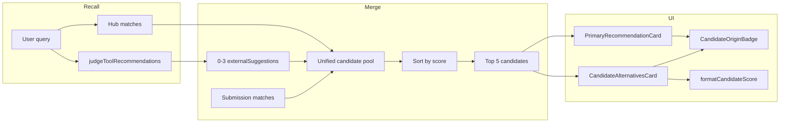

# Settings Guard, Voice Cancel, Score Display & External Candidates Design

**Date:** 2026-05-27  
**Status:** Approved pending user spec review

## Summary

Five related improvements to DoraPocket analysis/discovery UX and recommendation logic:

1. Unauthenticated settings: read-only with login prompt (option B)
2. Voice listening: bottom-bar stop button returning to idle
3. Recommendation cards: show match score in standard explanation mode
4. Recommendation pool: allow 2–3 external tools when Hub is weak; unified score sorting
5. Recommendation cards: clearly label Tool Hub vs Hub-external origin

---

## 1. Unauthenticated Settings (Fix)

### Goal

Guests can preview settings but cannot save; no silent failed PATCH.

### Behavior

- Use `useAuthSessionQuery()` → `isAuthenticated = session?.authenticated === true`
- **Not authenticated:**
  - Quick settings modal and Profile `PocketSettingsPanel` remain openable
  - All `Switch` / `SegmentedSettingControl` disabled
  - Banner: 「登录后才会同步到你的账号」
  - `patchUserSettings` returns early without calling `onSave`
  - Optional: clicking save path shows ambient notice if attempted
- **Authenticated:** unchanged

### Files

| File                                                     | Change                                               |
| -------------------------------------------------------- | ---------------------------------------------------- |
| `src/components/pocket/pocket-quick-settings-fields.tsx` | Add `readOnly`, banner, guard in `patchUserSettings` |
| `src/components/pocket/pocket-quick-settings-modal.tsx`  | Pass `readOnly`                                      |
| `src/components/pocket/pocket-settings-panel.tsx`        | Pass `readOnly`, banner                              |
| `src/components/profile-page.tsx`                        | Pass `isAuthenticated`                               |
| `src/App.tsx`                                            | Pass auth to modal                                   |
| `src/hooks/use-analysis-page-controller.ts`              | Expose `isAuthenticated`, wrap `saveUserSettings`    |

### Out of scope

LocalStorage temporary settings (option C).

---

## 2. Voice Cancel Button (Advance)

### Goal

During `appState === 'listening'`, user can cancel without submitting to agent.

### Behavior

- New `cancelVoiceInput()` in `use-voice-input.ts`:
  - `disposeSpeechSession()`
  - `setTranscript('')`
  - `setAppState('idle')`
  - Does **not** call `handleSpeechEnd`
- When `listening` + voice input mode, show stop button in `AnalysisInputComposer`
- Label: 「停止」; aria-label: 「停止录音」
- Hold-to-talk release still submits via existing flow

### Files

| File                                              | Change                    |
| ------------------------------------------------- | ------------------------- |
| `src/hooks/use-voice-input.ts`                    | Export `cancelVoiceInput` |
| `src/hooks/use-analysis-page-controller.ts`       | Wire through              |
| `src/components/analysis-input-composer.tsx`      | Stop button UI            |
| `src/components/dora-bottom-interaction-zone.tsx` | Pass handler              |
| `src/App.tsx`                                     | Pass handler              |

`ListeningHud` stays decorative (`pointer-events-none`).

---

## 3. Match Score Display (Advance)

### Goal

Surface internal `AgentCandidate.score` when explanation mode is standard.

### Behavior

- Helper `formatCandidateScore(candidate: AgentCandidate): string` → e.g. `匹配度 87`
- Show on `CandidateAlternativesCard`, `CandidateComparisonList`, optionally `PrimaryRecommendationCard`
- Hide when `explanationMode === 'brief'` (read from user settings in parent or prop)
- External candidates use existing `score = round(externalConfidence * 100)`

### Files

| File                                                       | Change                 |
| ---------------------------------------------------------- | ---------------------- |
| `src/components/discovery/candidate-score.ts` (new)        | Format helper          |
| `src/components/discovery/candidate-alternatives-card.tsx` | Score badge            |
| `src/components/discovery/candidate-comparison-list.tsx`   | Score badge            |
| `src/components/discovery/primary-recommendation-card.tsx` | Optional leader score  |
| `src/components/discovery/compact-decision-panel.tsx`      | Pass `explanationMode` |

---

## 4. External Candidates in Pool (Advance — option B)

### Goal

When Tool Hub lacks relevant tools, 2–3 external suggestions can appear in any rank (primary or alternatives), not only as a forced primary.

### Current problems

- Only 1 `externalSuggestion` from LLM
- When `preferExternal === false`, external appended after Hub sort → rarely in top 5
- Alternatives (`slice(1,4)`) are almost always Hub tools

### Backend changes

#### 4.1 LLM output schema (`tool-rerank.ts`)

Extend JSON format:

```json
{
  "ranking": [{ "toolId": "...", "reason": "..." }],
  "externalSuggestions": [
    {
      "title": "...",
      "url": "https://...",
      "reason": "...",
      "externalBoundary": "...",
      "externalConfidence": 0.0
    }
  ],
  "preferExternal": false,
  "hubInsufficient": false,
  "selectionReason": "..."
}
```

- Accept legacy `externalSuggestion` (singular) for backward compatibility
- Normalize to array, cap at **3** items
- Each item: same validation as today (valid https URL, dedupe against Hub by hostname/title)
- Confidence thresholds:
  - Default inclusion: `>= 0.72`
  - When `hubInsufficient === true` OR top Hub match score `< 45`: inclusion `>= 0.65`
  - `preferExternal`: first external with `>= 0.78` and `preferExternal === true` may rank #1

#### 4.2 Candidate merge (`ui-payload.ts`)

Replace dual-branch append logic with unified sort:

```typescript
const externalCandidates = judgement.externalSuggestions // 0–3 items
const candidates = [...hubCandidates, ...submissionCandidates, ...externalCandidates]
  .sort((a, b) => b.score - a.score)
  .slice(0, 5)
```

Remove preferExternal-only prepend branch; `preferExternal` can boost first external score (+5 or set min score to beat top Hub) when LLM asserts it.

#### 4.3 Types (`market-types.ts`, `tool-rerank.ts`)

- `ToolRecommendationJudgement.externalSuggestions: AgentCandidate[]`
- Deprecate singular `externalSuggestion` in return type (internal only)

#### 4.4 Prompt updates

- Instruct model: when Hub candidates are weak/irrelevant, return up to 3 `externalSuggestions`
- Hub reranking still only references Hub toolIds
- External must be real URLs user can open

### Tests

- Unit test: unified sort places high-confidence external at rank 2–3 when Hub scores low
- Unit test: normalize 1–3 external suggestions, dedupe, cap at 3
- Unit test: legacy singular `externalSuggestion` still parsed

---

## 5. Origin Labels on Cards (Advance)

### Goal

Every recommendation card shows whether candidate is from Tool Hub or outside Hub.

### UI component

New `CandidateOriginBadge` in `src/components/discovery/candidate-origin-badge.tsx`:

| `sourceLabel` / `candidateType`    | Label    | Style                                               |
| ---------------------------------- | -------- | --------------------------------------------------- |
| `external` / `external_suggestion` | Hub 外   | Amber border/bg                                     |
| `builtin`, `market`, `pocket`      | Tool Hub | Sky/neutral; optional sub-label: 原生 / 市场 / 口袋 |

External cards also show truncated `externalBoundary` when present.

### Apply to

- `PrimaryRecommendationCard` — badge near title
- `CandidateAlternativesCard` — badge per card; external gets 「打开外部」 button
- `CandidateComparisonList` — replace inline `sourceLabel()` with shared component
- `DecisionHero` (optional consistency pass)

### Actions by origin

| Origin   | Primary actions               |
| -------- | ----------------------------- |
| Tool Hub | 立即打开, 收进口袋            |
| Hub 外   | 打开外部工具 (no pocket save) |

---

## Architecture diagram



---

## Error handling

| Case                          | Handling                                    |
| ----------------------------- | ------------------------------------------- |
| Unauthenticated PATCH         | Blocked client-side; no request             |
| LLM returns invalid externals | Filtered by URL/confidence validation       |
| All externals deduped         | Fall back to Hub-only list                  |
| Voice cancel mid-session      | Session disposed; idle state; no agent turn |

---

## Out of scope

- Changing Hub recall / vector retrieval
- More than 3 external suggestions per turn
- Persisting external tools to pocket without user submission flow

---

## Acceptance criteria

1. Logged-out user sees disabled settings + login banner; toggles do not PATCH
2. Voice listening shows stop button; cancel returns to idle without agent submission
3. Standard mode shows match score on primary/alternative cards; brief mode hides it
4. When Hub top score < 45 or LLM sets hubInsufficient, up to 3 valid externals can appear in top 5
5. All recommendation cards show Tool Hub vs Hub 外 badge; external alts have open-external action
